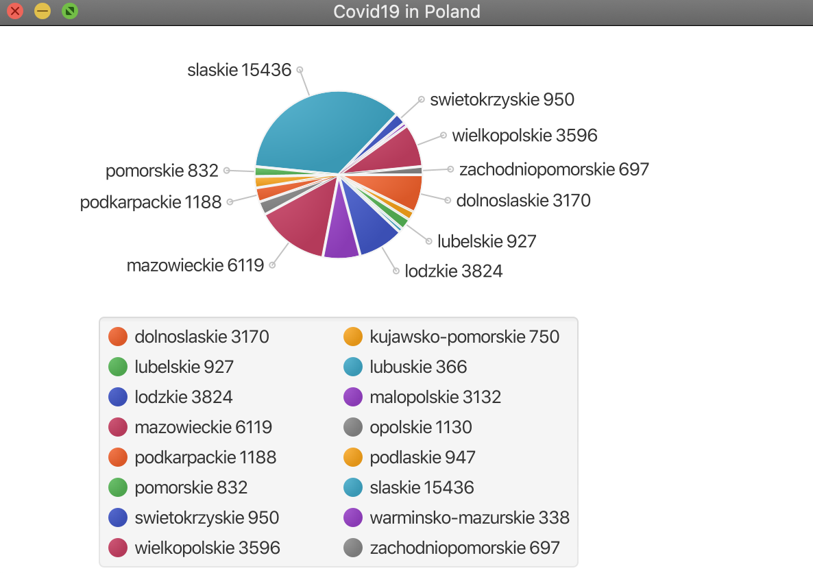

# Covid19-Poland-stats
App that shows current informations about infections in Poland as a chart.

### Technologies
Project is created with:
* Java 11
* Spring boot 2.3.2
* JavaFX
* Maven
* REST
* Lombok

## Features

  - Shows current informations about COVID-19 infections in Poland.
  - Data is displayed as a pie chart.

## Setup

To run this project go to app root folder and use mvn script:

```sh
$ ./mvnw spring-boot:run
```


